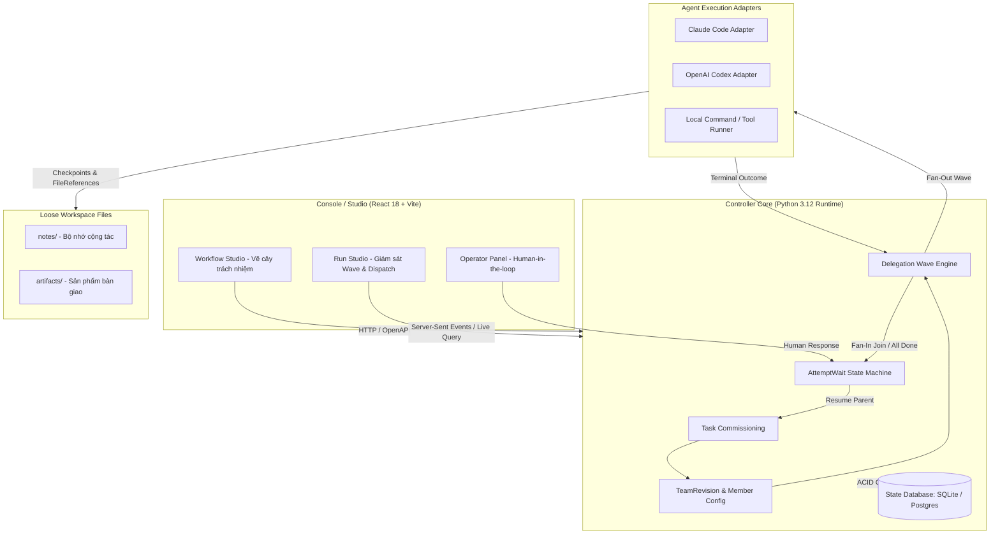
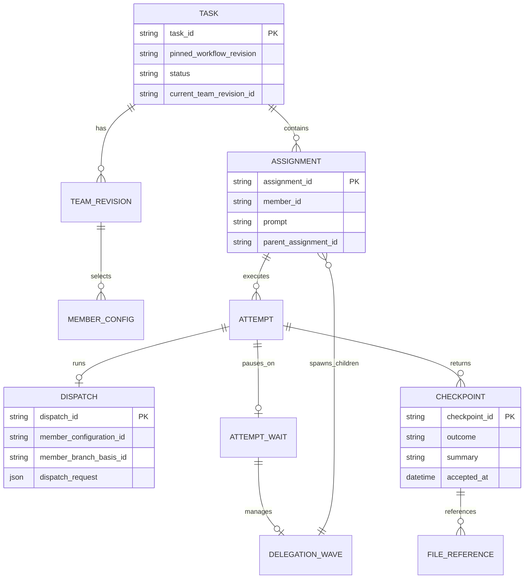
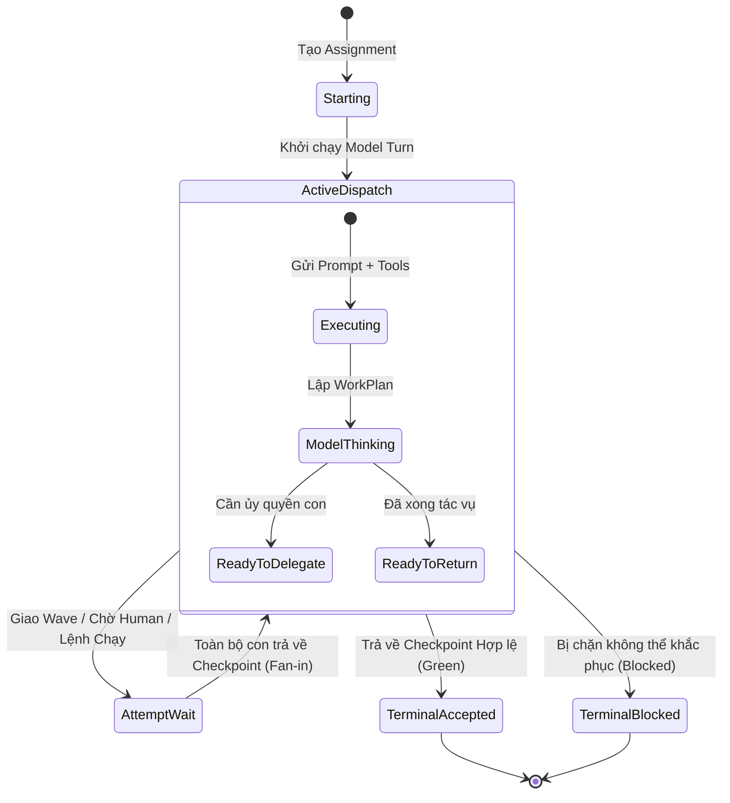

# OSS Blueprint — Oh My Subagents (https://github.com/ringlochid/oh-my-subagents @ commit fcc4398)

- **Ngày bóc tách**: 2026-09-30
- **License**: MIT License (Copyright © 2026 Yunan Zhang)
- **Chiến lược đã chọn**: **Chiến lược C — Lấy ý tưởng kiến trúc + Áp dụng chọn lọc (Clean-room Pattern Adoption)**
- **Mục đích của user**: Bóc tách hệ thống (OSS Blueprint) để học kiến trúc điều phối Subagents & áp dụng vào dự án Cine Prompt Pro
- **Bối cảnh đích**: Hệ thống Multi-Agent AI (Cine Prompt Pro) kết hợp Claude Code, Subagents và Model Router
- **Stack đích**: TypeScript / JavaScript (Web App + Node/Vite) & CLI Agents (Claude Code, Gemini, DeepSeek)

---

## 0. TL;DR — Tóm Tắt 10 Dòng

1. **Vấn đề cốt tử**: Các hệ thống Subagent thông thường (ad-hoc delegation) rất dễ phân mảnh: parent loop polling liên tục, ngữ cảnh bị phình to khi chuyển tiếp kết quả khổng lồ, và nếu terminal sập hoặc mạng đứt là toàn bộ phiên làm việc biến mất.
2. **Giải pháp của OMS**: Chuyển toàn bộ việc điều phối từ "chat transcript" vào **Durable Runtime State** có cấu trúc lưu trữ cơ sở dữ liệu (SQLite/PostgreSQL).
3. **Mô hình Wave Delegation**: Parent ủy quyền 1 "Wave" (nhóm công việc), lập tức đi vào trạng thái chờ (`AttemptWait`) mà **không chạy vòng lặp polling tốn token**.
4. **Hội tụ tự động (Fan-in Join)**: Controller giám sát các agent con; khi toàn bộ Wave hoàn thành (`terminal`), parent mới được kích hoạt lại kèm các bản tóm tắt tinh gọn (`Checkpoint`).
5. **Chống lười (Anti-Relay & Required Participation)**: Quản lý (Manager) không được phép copy prompt giao cho con rồi lấy nguyên văn kết quả nộp lên; bắt buộc 100% direct children phải có return đạt chuẩn `green`.
6. **Khả năng Replan động**: Quản lý có thể tái cấu trúc nhánh phụ trách ngay giữa phiên làm việc nếu dữ liệu thực tế thay đổi mà không làm hỏng lịch sử đã cam kết.
7. **Hồi phục sau gián đoạn (Interruption Recovery)**: Sập nguồn hoặc ngắt kết nối API? Khởi động lại hệ thống sẽ tiếp tục đúng Dispatch đang dang dở, không chạy lại các agent đã hoàn thành.
8. **File Reference thay vì text khổng lồ**: Chỉ truyền các con trỏ file (`{path, description}`) trong workspace thay vì nhét hàng chục ngàn dòng code/prompt vào context window.
9. **Giao diện Trực quan (Console)**: Đi kèm một Studio React chuyên nghiệp cho phép thiết kế cây trách nhiệm, theo dõi live run và can thiệp thủ công (Human Request).
10. **Giá trị với Cine Prompt Pro**: Nâng cấp 6 Trụ Cột hiện tại từ "các prompt chạy đơn lẻ" thành **Mạng lưới AI Chuyên trách có cam kết trách nhiệm bền bỉ, không mất trạng thái**.

---

## 1. Cổng Pháp Lý (Legal Gateway)

* **SPDX License**: `MIT` (`LICENSE:1-21`)
* **Bản quyền**: Copyright (c) 2026 Yunan Zhang.
* **Quyền hạn**: Được phép tự do sao chép, sửa đổi, hợp nhất, phân phối, bán thương mại hoặc tích hợp vào hệ thống đóng mã nguồn.
* **Ràng buộc**: Giữ nguyên thông báo bản quyền và tuyên bố miễn trừ trách nhiệm (Notice & Disclaimer).
* **Đánh giá rủi ro pháp lý**: **0% rủi ro** (Green Light). Hoàn toàn an toàn để áp dụng ý tưởng hoặc tái hiện lại kiến trúc trong dự án cá nhân hoặc thương mại.

---

## 2. Tổng Quan Hệ Thống & Sơ Đồ Kiến Trúc

OMS chia tách rạch ròi giữa **Thiết kế tổ chức (Workflow Definition)** và **Thực thi nhiệm vụ (Runtime Execution)**.



---

## 3. Glossary — Ngôn Ngữ Nghiệp Vụ Chuẩn

1. **Workflow**: Bản đặc tả cây trách nhiệm tái sử dụng được (Ai làm gì). Không phải là sơ đồ tuần tự cố định (DAG) hay lịch trình đóng băng.
2. **Task**: Một lần chạy thực tế được gắn với một phiên bản Workflow cố định, một workspace và một Task Lead duy nhất.
3. **Member**: Nút cấu trúc nắm giữ trách nhiệm trong cây tổ chức.
4. **Task Lead**: Member cao nhất, chịu trách nhiệm cuối cùng nộp kết quả (`Result`) cho người dùng.
5. **Manager**: Vai trò tự động của một Member khi có các Member con trực tiếp.
6. **Contributor**: Vai trò tự động của một Member khi không có Member con (trực tiếp thi hành tác vụ).
7. **Assignment**: Nhiệm vụ bất biến được giao cho một Member, bao gồm prompt yêu cầu và các con trỏ file (`FileReference`).
8. **Delegation Wave**: Một đợt ủy quyền phân tán (Fan-Out) gồm nhiều Assignment con được thực hiện song song hoặc theo đợt.
9. **Checkpoint**: Báo cáo công việc có cấu trúc được lưu bền vững, tóm tắt những gì đã làm và bàn giao sản phẩm.
10. **Continuation**: Ngữ cảnh kế tiếp của một Member sau khi các con hoàn thành Wave hoặc sau khi hồi phục từ lỗi.
11. **Result**: Checkpoint cuối cùng được phê duyệt của Task Lead nộp cho người dùng (`green` hoặc `blocked`).

---

## 4. Actor & Phân Quyền (Actors & Capability Matrix)

| Actor / Vai trò | Quyền hạn cốt lõi | Ràng buộc nghiệp vụ |
| :--- | :--- | :--- |
| **User (Operator)** | Khởi tạo Task, xem tiến độ trực tiếp, trả lời câu hỏi can thiệp (`HumanRequest`). | Không can thiệp sửa đè vào trạng thái đang Dispatch; chỉ tương tác qua hàng đợi controller. |
| **Task Lead** | Tiếp nhận mục tiêu từ User, quyết định ủy quyền cho Manager con, xuất `Result` cuối cùng. | Bắt buộc phải có kết quả tự nghiệm chứng trước khi trả về `green`. |
| **Manager** | Phân rã Assignment, giao việc theo Wave, duyệt Checkpoint của con, kích hoạt Replan nếu cần. | **Bị cấm Anti-Relay**: Không được bê nguyên kết quả của con làm của mình; không được hoàn thành nếu con chưa đạt `green`. |
| **Contributor** | Chạy công cụ (shell, file edit, linter), tạo artifact bàn giao, trả về Checkpoint. | Không thể tạo thêm nhánh con mới; chỉ tập trung giải quyết đúng Assignment được giao. |

---

## 5. Data Model & ERD



---

## 6. Máy Trạng Thái Của Thực Thể (State Machine)

### Vòng đời của một Attempt (Đợt thực thi nhiệm vụ)



---

## 7. Các Luật Nghiệp Vụ & Bất Biến (Business Rules & Invariants)

1. **Luật Không Polling (Zero Polling Invariant)**:
   * *Mô tả*: Parent sau khi delegate xong thì **ngay lập tức dừng tiến trình**, chuyển sang trạng thái ngủ (`AttemptWait`). Controller là bên duy nhất lắng nghe tín hiệu hoàn thành của các con.
   * *Nguồn gốc*: `docs-internal/architecture/runtime.md:44-50`.
2. **Luật Tham Gia Bắt Buộc (Required Participation Rule)**:
   * *Mô tả*: Một Manager muốn kết thúc với trạng thái `green` thì **100% các Member con trực tiếp** thuộc nhánh cấu hình hiện tại phải có ít nhất một Checkpoint `green` được chấp thuận. Không được bỏ rơi cấp dưới.
   * *Nguồn gốc*: `docs-internal/architecture/runtime.md:74-88`.
3. **Luật Chống Chuyển Tiếp Mù (Anti-Relay Rule)**:
   * *Mô tả*: Manager bị đánh giá là thất bại (Quality Failure) nếu sao chép nguyên văn prompt cha giao cho con, rồi lấy nguyên văn Checkpoint con nộp lên làm kết quả của mình.
   * *Nguồn gốc*: `docs-internal/architecture/runtime.md:70-73`.
4. **Luật Tái Cấu Trúc Động (Safe Dynamic Replan)**:
   * *Mô tả*: Khi dữ liệu phát sinh đòi hỏi thêm hoặc bớt vai trò mới, hệ sinh ra `TeamRevision` mới nhưng không xóa bỏ lịch sử commit cũ.
   * *Nguồn gốc*: `docs-internal/architecture/runtime.md:80-89`.
5. **Luật Bất Biến Nhiệm Vụ (Immutable Assignment)**:
   * *Mô tả*: Khi một Assignment đã ban hành, prompt và file input của nó không bao giờ được phép sửa đổi. Nếu muốn đổi hướng, phải tạo Assignment mới.
   * *Nguồn gốc*: `docs-internal/architecture/runtime.md:158-164`.

---

## 8. Danh Mục Use-Case Cốt Lõi

1. **UC-01: Phân rã song song (Parallel Fan-Out)**: Giao việc đồng thời cho 3 chuyên gia (ví dụ: Chuyên gia ánh sáng, Chuyên gia góc máy, Chuyên gia kịch bản) cùng thẩm định một kịch bản.
2. **UC-02: Vòng lặp phản biện (Evaluator-Optimizer Iteration)**: Agent A viết prompt -> Agent B (Linter/Critic) đánh giá -> Nếu chưa đạt 8 tiêu chí Jev System 1 thì Manager kích hoạt Assignment sửa chữa cho Agent A.
3. **UC-03: Tự hồi phục khi sập tiến trình (Crash Recovery)**: Đang chạy mà người dùng tắt nhầm tab/máy tính -> Mở lại chỉ cần resume, controller tự nạp lại trạng thái Wave từ SQLite.
4. **UC-04: Can thiệp của con người (Human-in-the-loop Gate)**: Khi chi phí token vượt ngưỡng hoặc cần quyết định sáng tạo then chốt, hệ thống kích hoạt `HumanRequest` chờ người dùng click chọn trên giao diện rồi mới đi tiếp.

---

## 9. Đánh Giá LẤY / THAY / BỎ / HOÃN (Cho Cine Prompt Pro)

| Thành phần | Đánh giá | Lý do & Cách điều chỉnh cho Cine Prompt Pro |
| :--- | :---: | :--- |
| **Wave Delegation & Fan-in Join** | **LẤY NGAY** | Áp dụng trực tiếp vào pipeline 6 Trụ Cột: Khi bấm "Chạy chiến dịch", Step 1-2 có thể kích hoạt các subagents song song và hội tụ tự động thay vì đợi tuần tự. |
| **Required Participation & Anti-Relay** | **LẤY NGAY** | Đảm bảo Claude Code và các agent con không bao giờ "ăn bớt" công đoạn thẩm định ánh sáng hoặc đạo diễn. |
| **Checkpoints & FileReferences** | **LẤY NGAY** | Thay vì truyền prompt 10.000 từ qua lại giữa các cửa sổ chat, ghi ra tệp `artifacts/` và chỉ truyền đường dẫn. Giảm 80% chi phí token! |
| **PostgreSQL Database** | **THAY** | Thay bằng **IndexedDB / SQLite nội bộ / LocalStorage** trên trình duyệt kết hợp hệ thống tệp `.agents/` sẵn có để giữ ứng dụng chạy nhẹ nhàng không cần setup server cồng kềnh. |
| **Codex Provider cũ** | **BỎ** | Thay bằng **Model Router** hiện có của dự án (Gemini 2.5 Pro cho reasoning, Claude 3.5 Sonnet cho thẩm mỹ, DeepSeek V3 cho tốc độ). |
| **Console React riêng biệt** | **HOÃN** | Cine Prompt Pro đã có sẵn giao diện Studio 3 cột Hollywood rất đẹp và trực quan. Không cần dựng thêm một web console thứ hai làm phân mảnh người dùng. |

---

## 10. Bài Học Rút Ra & Bẫy Cần Tránh

* **Điểm mạnh lớn nhất**: Khái niệm **"Durable State"**. Agent không sống trong cửa sổ chat; agent sống trong cơ sở dữ liệu trạng thái.
* **Bẫy cần tránh (Gotcha)**:
  * Tránh tạo quá nhiều tầng Manager lồng nhau (quá 2 cấp quản lý gây lãng phí token cho việc tổng hợp Checkpoint).
  * Tránh nhồi nhét toàn bộ lịch sử trò chuyện vào mỗi lượt gọi: Chỉ truyền **Bản tóm tắt Checkpoint** của cấp dưới cho cấp trên.

---

## 11. Bản Thiết Kế Tích Hợp Vào Cine Prompt Pro (Actionable Design)

Áp dụng mô hình **Cine-Wave Orchestrator** vào thư mục `.agents/` và `js/aiService.js`:

```text
[Người Dùng] -> Nhập Ý Tưởng Điện Ảnh
       │
[Task Lead: Đạo Diễn Trưởng (Director Agent)]
       │
       ├── Wave 1: Khai phá & Nghiên cứu (Parallel)
       │    ├── Trụ Cột 1: Commercial Glossary Agent (Từ vựng thương mại)
       │    └── Trụ Cột 2: Visual Mastery Agent (Ánh sáng & Góc máy)
       │
       ├── Wave 2: Thẩm định & Tối ưu (Sequential Join)
       │    └── Trụ Cột 3: Jev System 1 Linter (8 tiêu chí nguyên tử)
       │
       └── Wave 3: Xuất bản & Chống gian lận (Fan-In)
            ├── Trụ Cột 4: Model Router (Phân phối prompt tối ưu)
            └── Trụ Cột 5 & 6: Red Team Guard & Visual Proofing
```

*Mỗi bước trên đều xuất file kết quả vào `artifacts/` và chỉ gửi Checkpoint tóm tắt về bảng điều khiển trung tâm.*

---

## 12. Roadmap 4 Giai Đoạn Triển Khai

* **Giai đoạn 0 (Walking Skeleton)**: Định nghĩa hợp đồng cấu trúc `CineWave` và `Checkpoint` trong `js/aiService.js`.
* **Giai đoạn 1 (Core Domain)**: Tích hợp cơ chế Fan-out / Fan-in cho Step 3 & Step 4 của Cine Prompt Pro, đảm bảo các agent chạy song song không đè dữ liệu.
* **Giai đoạn 2 (Vành đai an toàn)**: Cài đặt bộ kiểm tra `Required Participation` (nếu thiếu đánh giá ánh sáng thì không cho phép xuất prompt cuối).
* **Giai đoạn 3 (Vận hành & Hồi phục)**: Tự động lưu checkpoint vào `localStorage` / `.agents/state/` để khi người dùng reload trang (`F5`), toàn bộ chiến dịch đang render dở vẫn giữ nguyên trạng thái.

---

## 13. Phụ Lục & Tham Chiếu File Nguồn

* `README.md:31-41`: So sánh Ad-hoc subagents vs Oh My Subagents.
* `docs-internal/architecture/runtime.md:15-35`: Runtime grammar và cấu trúc Dispatch/Wave.
* `docs-internal/architecture/runtime.md:74-89`: Định nghĩa chính xác luật Required Participation.
* `docs-internal/architecture/product-and-workflow.md:36-50`: Từ điển ngữ nghĩa chuẩn (Glossary) của hệ thống.
* `console/src/features/workflow-studio/canvas/TeamCanvas.tsx`: Mã nguồn giao diện visualizer cây trách nhiệm bằng React.
