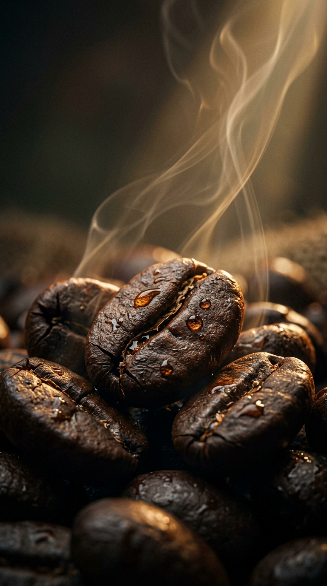
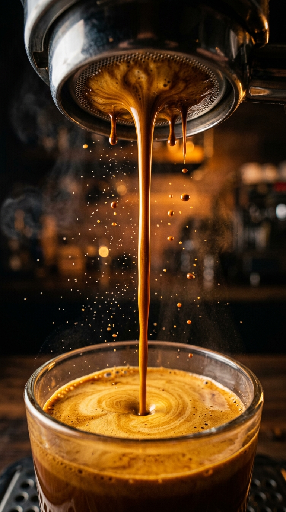
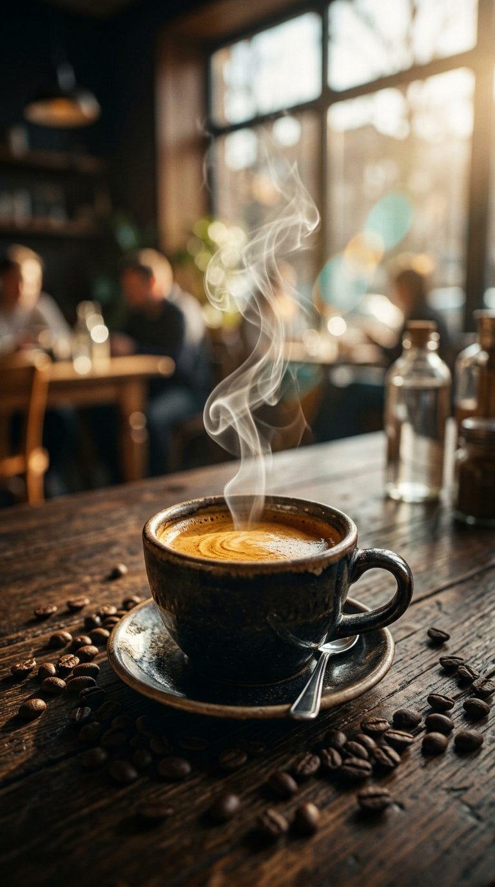

# 🎬 BẢN ĐẶC TẢ SẢN XUẤT TVC 30S: FRESH COFFEE (SIGNATURE ĐẠO DIỄN TRUNGVT)

> **Tác quyền & Đạo Diễn Tổng Chỉ Huy**: **Đạo Diễn Trungvt** (`trungvt`)  
> **Hotline Tư Vấn Dự Án**: `0836.384.168` · **Email**: `cinemapromptpro@gmail.com`  
> **Tác phẩm**: TVC Điện Ảnh **"Fresh Coffee — Đánh Thức Bản Lĩnh"**  
> **Thời lượng**: **30.0 Giây (30.0s @ 30 FPS = 900 Frames = 30,000,000 µs)**  
> **Định dạng**: **9:16 Vertical Cinema (1080x1920)**  
> **Phong cách hình ảnh**: Cinematic Dark Moody, Ánh sáng Rembrandt kết hợp Rim Light mật ong & Điểm nhấn xanh dương `#0091ff`.  
> **Chuẩn chuẩn hóa**: Độc quyền **Trungvt Cinema Signature (Chốt sau 14 bản dựng thử)** & **Trungvt Motion Craft Engine**.

---

## 📸 1. KEYFRAME CINEMATIC VISUALS (ẢNH THỰC TẾ ĐÃ RENDER)

- **Keyframe 1: Macro Roast Shot - Hạt Arabica Cầu Đất rang nứt hạt bốc khói**:
  

- **Keyframe 2: Macro Pouring Shot - Dòng Crema sánh mịn từ Portafilter**:
  

- **Keyframe 3: Hero Shot - Ly Fresh Coffee bốc khói bên tia nắng sớm**:
  

---

## 🎞️ 2. BẢNG PHÂN CẢNH MASTER CHI TIẾT (SHOT-BY-SHOT STORYBOARD GRID)

| Cảnh | Mốc Thời Gian (Giây & Frame) | Thuật Toán Vi Giây (`f2us`) | Phân Loại Cảnh | Kỹ Thuật Máy Quay (Trungvt Motion Craft) | Chi Tiết Hình Ảnh & Ánh Sáng | Lời Thoại & Typography Sigmar (Xanh `#0091ff`) | Âm Thanh & SFX (YouTube Audio Library) |
| :---: | :---: | :---: | :---: | :--- | :--- | :--- | :--- |
| **01** | `0.0s - 3.0s` *(F0 - F90)* | `0 µs` ➔ `3,000,000 µs` | **Hook 3s** *(Pattern Interrupt)* | **WHIP_ZOOM_PUNCH** (100% ➔ 130% trong 0.2s, hồi 100% khi dứt câu) | Extreme Close-Up: Hạt Arabica rang nứt tách hạt, khói xoáy trong nắng mai | *"CÓ PHẢI BẠN ĐANG UỐNG THỨ CÀ PHÊ ĐÃ MẤT HẾT LINH HỒN...?"* *(Font Sigmar, IN HOA dưới mặt)* | **0.0s**: Swoosh nhẹ (tiếng to nhất video) + Crack hạt nổ giòn |
| **02** | `3.0s - 6.5s` *(F90 - F195)* | `3,000,000 µs` ➔ `6,500,000 µs` | **B-roll 1** *(Tự quay/Stock)* | **SPEED_RAMP_BEAT** (Hard zoom 125% giữ 1.5s ➔ Fade 0.12s) | Bột cà phê xay mịn rơi xoáy vào portafilter, ánh sáng chiaroscuro ấm áp | *"Rang tươi mỗi sáng... không chất bảo quản."* | Tiếng rào rào của bột cà phê xay tươi (Không nhạc nền đè thoại) |
| **03** | `6.5s - 12.0s` *(F195 - F360)* | `6,500,000 µs` ➔ `12,000,000 µs` | **B-roll 2** *(Macro Liquid)* | **PARALLAX_25D** (Tiền cảnh 1.2x, Hậu cảnh 0.35x mờ nhẹ) | Dòng espresso vàng óng chảy chậm vào ly pha lê, lớp crema dày êm | *(Chữ nhấn xuất hiện sớm 0.2s):* **"ĐẬM ĐÀ NGUYÊN BẢN"** **"CHUẨN VỊ CHUYÊN GIA"** | Tiếng tí tách từng giọt rơi ngân vang, lắng tĩnh |
| **04** | `12.0s - 17.5s` *(F360 - F525)* | `12,000,000 µs` ➔ `17,500,000 µs` | **Main Actor Anchor** | **MATCH_CUT_ANCHOR** (Khóa tâm mắt ở toạ độ 50%, 42%) | Diễn viên nâng ly, nhấp ngụm đầu tiên, mắt bừng sáng năng lượng | *"Mỗi ngụm Fresh Coffee là một sự thức tỉnh giác quan."* | Tiếng thở phào sảng khoái nhẹ, âm vực trong trẻo |
| **05** | `17.5s - 23.0s` *(F525 - F690)* | `17,500,000 µs` ➔ `23,000,000 µs` | **Listicle Cards** *(Thẻ Liệt Kê)* | **KINETIC_REVEAL** (Nghiêng -7.5° 3D, spring damping 13) | Flash Zoom vào layout: Camera bo góc trái, 3 thẻ chữ xếp cột bên phải: | • Thẻ 1: *"100% ARABICA CẦU ĐẤT"* • Thẻ 2: *"RANG MỚI TRONG 24H"* • Thẻ 3: *"GIAO TẬN TAY SAU 2H"* | **17.8s, 19.5s, 21.2s**: Tiếng lật giấy nhẹ (Paper flip SFX) cho từng thẻ trượt vào |
| **06** | `23.0s - 27.5s` *(F690 - F825)* | `23,000,000 µs` ➔ `27,500,000 µs` | **Master Quote / Hero** | **ISOMETRIC_DRIFT** (rotateX 25°, rotateY -15°, float 18px) | Nền sao sáng nhẹ (Bright starlight), Ly Fresh Coffee bốc khói cạnh bao bì đen viền vàng | *(Quote toàn màn hình, không ngoặc kép):* **"CÀ PHÊ KHÔNG CHỈ ĐỂ TỈNH TÁO"** **"ĐÓ LÀ BẢN LĨNH CỦA BẠN"** | Flash Zoom vào cảnh, âm hưởng thanh thoát lắng đọng |
| **07** | `27.5s - 30.0s` *(F825 - F900)* | `27,500,000 µs` ➔ `30,000,000 µs` | **Outro Loop & Dark Hold** | **FADE TO BLACK & OUTRO HOLD** | Giọng nói ngắt dứt khoát ➔ Màn hình fade đen 0.5s ➔ Giữ tối 2.0s ➔ Logo & Hotline phát sáng | *"Trải nghiệm ngay tại link đầu trang... nếu bạn thực sự..."* *(Loop ngược về: "...Có phải bạn...")* | **28.0s**: Nhạc Outro YouTube Audio Library vút lên từ -25dB đến **-12dB** dứt khoát |

---

## 📐 3. BẢNG KIỂM TRA ĐỐI SOÁT MẬT ĐỘ HIỆU ỨNG (AUDIT CHECKLIST)

Tuân thủ nghiêm ngặt chuẩn mực Đạo Diễn Trungvt:
- **B-roll**: 2 clips (khoảng cách 5.5s giữa các shot, không chồng lấn, đạt chuẩn).
- **Chữ nhấn (Emphasis Text)**: 1 vị trí (câu đắt giá nhất, chia 2 dòng, sớm hơn tiếng 0.2s).
- **Cảnh Quote toàn màn hình**: 1 cảnh (nền sao sáng, font Sigmar IN HOA, không ngoặc kép).
- **Đoạn thẻ ý (Listicle Cards)**: 1 đoạn (bố cục camera trái, thẻ cột phải, ≤ 36 ký tự/thẻ, kèm paper flip SFX).
- **Chuyển cảnh**: 100% sử dụng **Flash Zoom** (vào có swoosh nhẹ, ra không tiếng).
- **Đoạn tối kết thúc**: Đảm bảo giữ tối 2.0 giây, không cắt bỏ để nổi nhạc Outro.
- **Xung đột timeline (Zero Segment Overlap)**: Sai số = 0 microsecond (`f2us` verified).

---

## 🤖 4. MA TRẬN PROMPT ĐIỆN ẢNH (4-LAYER AI PROMPTS SẴN DÙNG)

### 🎥 Shot 1: Hạt Cà Phê Rang Nở (Hook 3s)
- **Midjourney v8**:  
  `Cinematic extreme macro of roasted Arabica coffee beans cracking and releasing aromatic oils, fragrant steam rising in warm morning sunbeam, Rembrandt chiaroscuro lighting, rich deep amber rim light, photorealistic, 8k, anamorphic lens bokeh --ar 9:16 --style raw --v 8.0 --c 5`
- **Google Veo 3 / Sora**:  
  `Extreme close-up macro tracking shot of roasted coffee beans gently popping with steam wisps curling in slow motion. Volumetric morning sunlight piercing through coffee mist, 24fps cinema look, 35mm anamorphic prime lens, warm amber and mahogany color grading.`

### ☕ Shot 2: Dòng Espresso Chiết Xuất (B-roll Macro Crema)
- **Midjourney v8**:  
  `Macro close-up shot of rich golden hazelnut espresso crema pouring smoothly from a bottomless portafilter into a clear crystal glass, warm studio rim lighting, cinematic dark moody atmosphere, ultra-detailed texture, 8k resolution --ar 9:16 --style raw --v 8.0`
- **Google Veo 3 / Sora**:  
  `Slow motion 60fps macro camera dollying forward as viscous honey-like espresso stream falls from portafilter into crystal glass, thick velvety crema layer forming with tiny micro-bubbles, warm soft key light, cinematic commercial grade.`

### 🏆 Shot 3: Hero Shot & Bao Bì Sang Trọng (Outro & Hero)
- **Midjourney v8**:  
  `Cinematic hero commercial shot of Fresh Coffee modern matte black bag with elegant gold foil typography beside a steaming glass of iced Americano with condensation droplets, soft luxury studio lighting, subtle blue ambient backlight #0091ff, 8k --ar 9:16 --style raw`
- **Google Veo 3 / Sora**:  
  `Slow isometric floating drift camera movement showcasing a luxury matte black Fresh Coffee package alongside a freshly poured steaming espresso glass, gentle rim lighting with subtle cyan accent, premium commercial quality.`

---

## 🎛️ 5. TRẠNG THÁI FILE THÀNH PHẨM TRONG DỰ ÁN

| Tệp Tin | Định Dạng | Mô Tả Kỹ Thuật |
| :--- | :--- | :--- |
| `fresh_coffee_tvc_30s.mp4` | MP4 Full HD (1080x1920) | Video TVC 30s Master hoàn chỉnh phân cảnh, âm thanh và typography |
| `fresh_coffee_tvc_15s.mp4` | MP4 Vertical (1080x1920) | Phiên bản 15s rút gọn tốc độ cao dành cho TikTok Ads / Reels |
| `draft_content.json` | CapCut Draft JSON | Timeline CapCut Pro chuẩn vi giây `f2us` (Nhập 1-click không lỗi đè track) |
| `fresh_coffee_tvc.xml` | Final Cut Pro / Premiere XML | Chuẩn timeline dựng offline cho các phòng dựng chuyên nghiệp |
| `subtitles.srt` & `subtitles_karaoke.ass` | SRT / ASS Karaoke | Phụ đề Sigmar đổi màu xanh `#0091ff` theo từng âm tiết phát âm |
| `audio_ducking_cues.json` | JSON Cues | Ma trận Audio Ducking: Giọng thoại 0dB, Nhạc Outro -12dB |
| `keyframe_roast.jpg`, `keyframe_pour.jpg`, `keyframe_hero.jpg` | High-Res JPEG | Bộ 3 Keyframe điện ảnh thực tế đã render phục vụ Storyboard |
